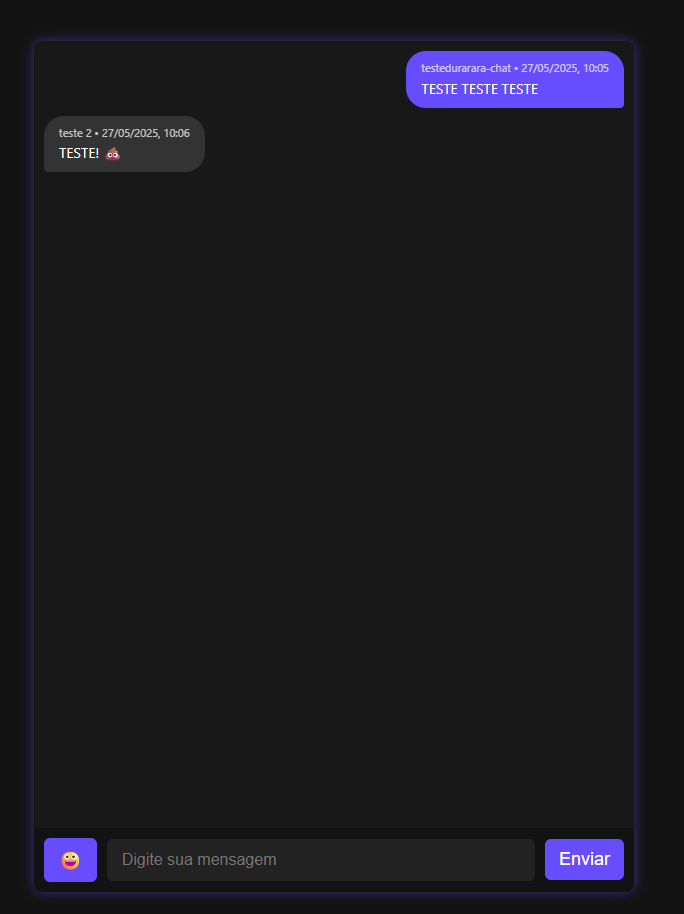

# 💬 Durarara Chat

Um chat anônimo em tempo real inspirado no fórum clandestino do anime **Durarara!!**. Visual escuro, minimalista e com funcionamento direto ao ponto — ideal para conversas livres, sem cadastro e sem rastros.

🔗 Acesse em: [durarara-chat.onrender.com](https://durarara-chat.onrender.com)

---

## ✨ Funcionalidades

- 🕵️‍♂️ **Login anônimo** — sem necessidade de e-mail ou autenticação real.
- 💬 **Mensagens em tempo real** — baseadas em WebSockets.
- 🧠 **Histórico público** — visível a todos que entrarem na sala.
- 📅 **Data e hora nas mensagens** — para facilitar o contexto.
- 🖤 **Tema escuro neon** — com design que remete à deep web dos animes.
- 🔐 **Dados salvos localmente** — nenhuma informação é armazenada no servidor.

---

## 🖼️ Prévia

### Tela de login:

### Interface do chat:

---

🛠 Tecnologias
Node.js com Express

Socket.io

JavaScript, HTML, CSS

Hospedagem gratuita via Render

🧠 Inspirado por
O famoso fórum anônimo do anime Durarara!!, onde qualquer pessoa pode postar com total liberdade, mantendo o mistério e o caos organizados do submundo digital.

📄 Licença
MIT — sinta-se livre para usar e adaptar.

